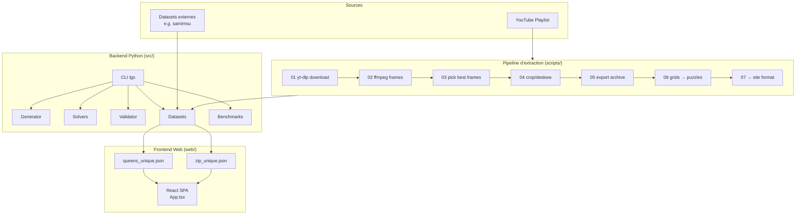

# Architecture — LinkedIn Games Solver
> Généré le 2026-03-26 via /workflows/bmad-brownfield

## Vue d'ensemble



## Modules Python

### `core/`
- **`types.py`** : `SolveResult` — type de retour commun à tous les solvers
- **`metrics.py`** : calcul de métriques de performance (time, nodes, backtracks)

### `games/queens/`
| Fichier | Rôle |
|---------|------|
| `parser.py` | Lit un puzzle JSON → `QueensPuzzle` |
| `generator.py` | Génère des puzzles aléatoires valides |
| `validator.py` | Vérifie une solution |
| `renderer.py` | Affichage ASCII |
| `solvers.py` | Registry des solvers |
| `solver_baseline.py` | Backtracking naïf |
| `solver_heuristic_*.py` | LCV + heuristiques |
| `solver_dlx.py` | Dancing Links (exact cover) |
| `solver_csp.py` | CSP + AC-3 |
| `solver_backtracking_bb.py` | Branch & Bound |
| `solver_min_conflicts.py` | Min-conflicts |
| `importers/samimsu.py` | Import dataset externe |

### `games/zip/`
| Fichier | Rôle |
|---------|------|
| `model.py` | `ZipPuzzle` dataclass |
| `parser.py` | Lit un puzzle JSON → `ZipPuzzle` |
| `generator.py` | Génère des puzzles Zip |
| `validator.py` | Vérifie une solution |
| `renderer.py` | Affichage ASCII |
| `solvers.py` | Registry des solvers |
| `solver_baseline.py` | DFS naïf |
| `solver_forced.py` | Propagation de contraintes forcées |
| `solver_articulation.py` | Pruning articulation points |
| `solver_heuristic.py` | LCV heuristic |
| `solver_counting.py` | Comptage de chemins |

### `datasets/`
- `exporter.py` — Export manifest JSON
- `normalize.py` — Normalisation des puzzles
- `organize.py` — Tri par taille
- `unique.py` — Annotation `solution: "unique"`

### `benchmarks/`
- Sortie JSONL (`id, puzzle_id, algo, solved, time_ms, nodes, backtracks`)

## Solvers disponibles

### Queens (7 algos)
| Algo | Type |
|------|------|
| `baseline` | Backtracking naïf |
| `heuristic_simple` | Heuristique simple |
| `heuristic_lcv` | Least Constraining Value |
| `dlx` | Dancing Links |
| `csp_ac3` | CSP + AC-3 |
| `backtracking_bb` | Branch & Bound + LCV |
| `backtracking_bb_nolcv` | Branch & Bound sans LCV |

### Zip (5 algos)
| Algo | Type |
|------|------|
| `baseline` | DFS naïf |
| `forced` | Propagation contraintes |
| `articulation` | Pruning articulation |
| `heuristic` | LCV |
| `heuristic_nolcv` | Sans LCV |

## Format des données

### Puzzle Queens (JSON)
```json
{
  "id": 1,
  "n": 6,
  "regions": [[0,0,1,1,2,2], ...],
  "givens": { "queens": [[r,c]], "blocked": [[r,c]] }
}
```

### Puzzle Zip (JSON)
```json
{
  "id": 1,
  "n": 5,
  "numbers": [{"k": 1, "r": 0, "c": 0}, ...],
  "walls": [{"r1": 0, "c1": 0, "r2": 0, "c2": 1}, ...]
}
```

## Frontend Web

Architecture monofichier (`App.tsx` ~1250 lignes) :

```
App.tsx
├── Types            : QueensPuzzle, ZipPuzzle, *Normalized, StatsSnapshot
├── Helpers          : formatDateKey, parseDateKey, isYesterday, loadStats
├── Normalisation    : normalizeQueensPuzzle(), normalizeZipPuzzle()
├── Solver inline    : logique de résolution embarquée (Queens + Zip)
├── Composants React : App() → rendu conditionnel selon view='queens'|'zip'
└── Persistance      : localStorage (clé 'linkedin-games-stats')
```

**Flux de données :**
```
fetch('/data/queens_unique.json') → normalize → useState → render grid
fetch('/data/zip_unique.json')   → normalize → useState → render grid
localStorage ← stats (completed, streak)
```

## Décisions techniques

| Décision | Choix | Raison |
|----------|-------|--------|
| SPA sans router | Vite + React | Site statique, 2 vues max |
| App.tsx monolithique | 1 fichier | MVP, pas de besoin de découpage |
| Données statiques JSON | `public/data/` | Pas de backend requis |
| Multi-solver Python | Fichiers séparés | Comparaison algorithmique |
| Pas de scraping LinkedIn | YouTube uniquement | Contrainte légale/éthique |
| Pipeline numéroté 00→07 | Scripts bash/python | Reproductibilité étape par étape |
