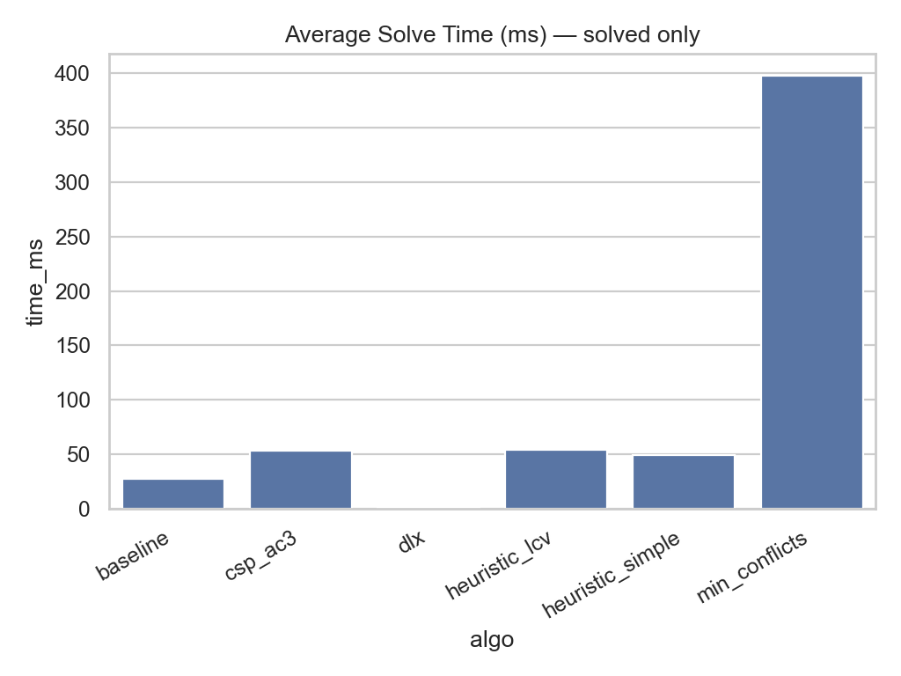
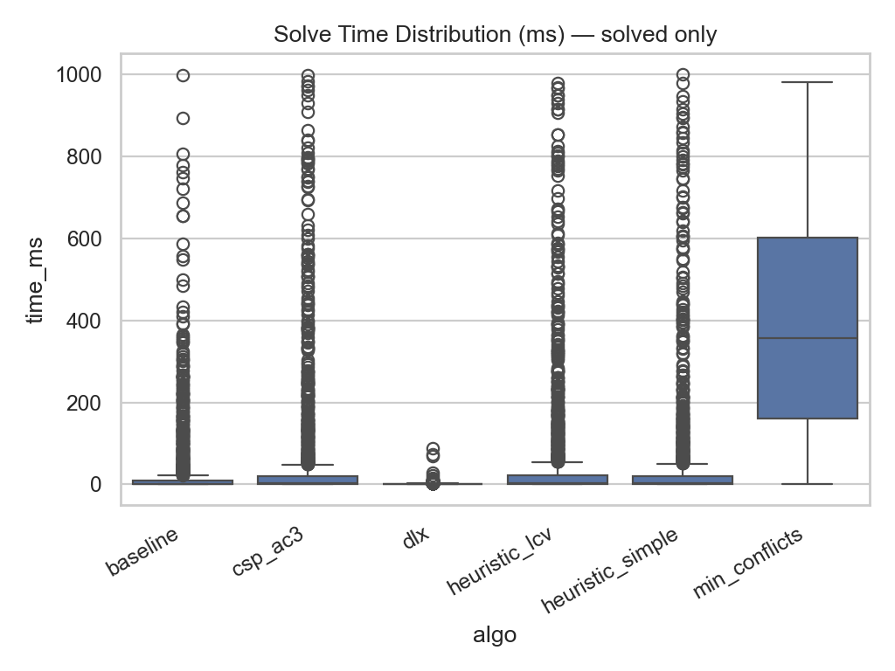
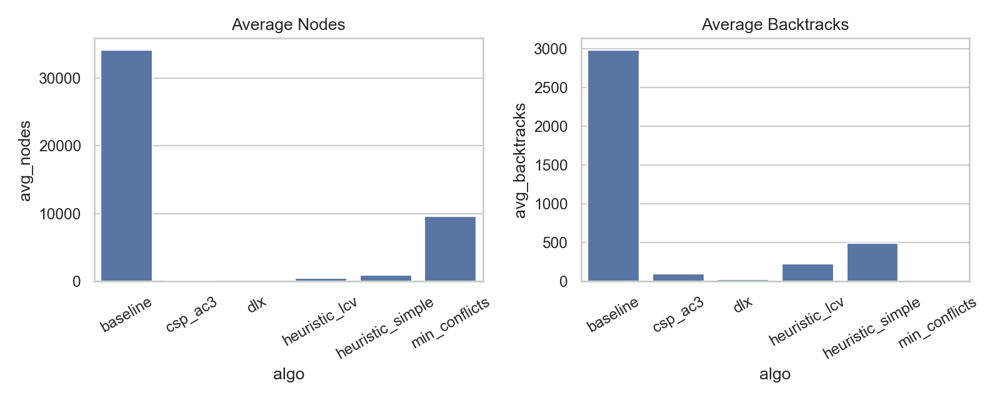
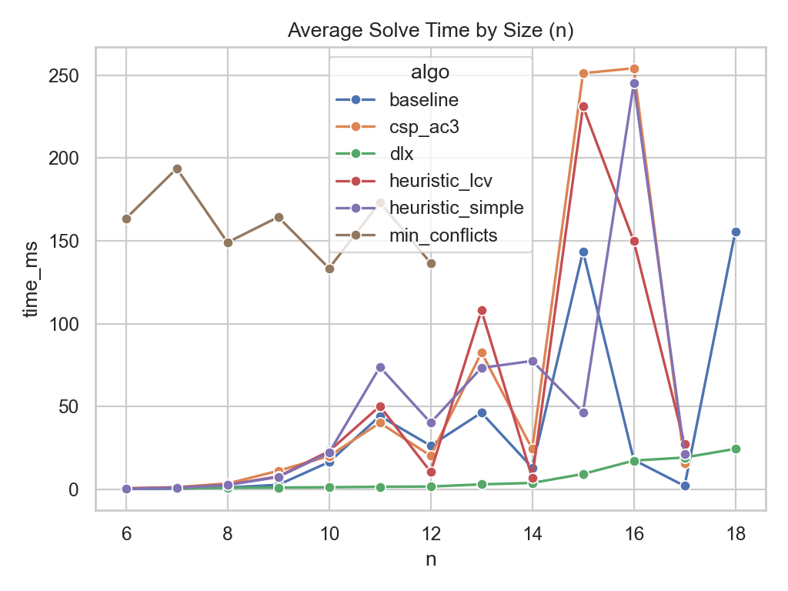
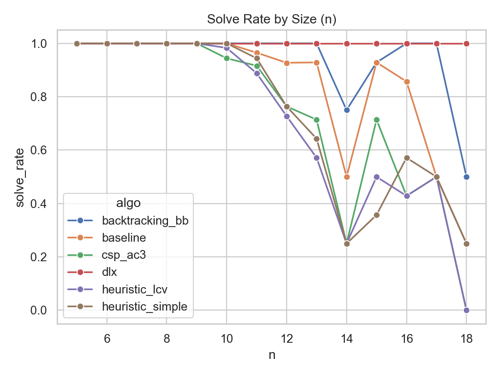

# Queens Data Science Report

- Source: `data/benchmarks/queens_runs.jsonl`
- Runs: 5538
- Unique puzzles: 473
- Algorithms: dlx, baseline, heuristic_lcv, csp_ac3, heuristic_simple, min_conflicts

## Summary Table

| algo             |   puzzles |   solved |   solved_rate |   avg_time_ms |   median_time_ms |   avg_nodes |   avg_backtracks |   timeout_rate |
|:-----------------|----------:|---------:|--------------:|--------------:|-----------------:|------------:|-----------------:|---------------:|
| dlx              |       923 |      923 |        100    |       1.33683 |         0.831958 |     35.8147 |          26.9502 |           0    |
| baseline         |       923 |      898 |         97.29 |      12.7447  |         0.263041 |  34161.8    |        2981.37   |           2.71 |
| heuristic_lcv    |       923 |      869 |         94.15 |      13.6538  |         1.25962  |    420.756  |         227.816  |           5.85 |
| csp_ac3          |       923 |      881 |         95.45 |      14.9582  |         1.80933  |    100.59   |          91.9523 |           4.55 |
| heuristic_simple |       923 |      877 |         95.02 |      18.6523  |         0.843875 |    875.184  |         493.41   |           4.98 |
| min_conflicts    |       923 |      410 |         44.42 |     163.778   |       136.334    |   9609.8    |           1.9122 |          55.58 |

## Charts

