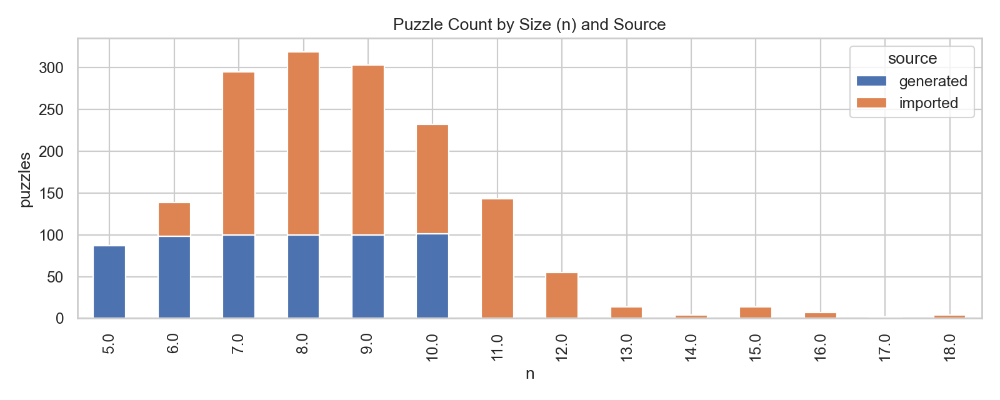
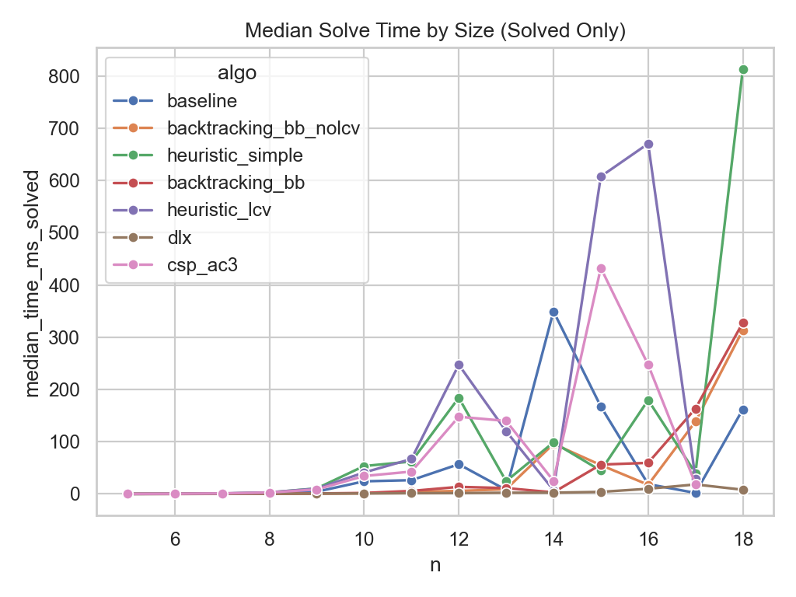
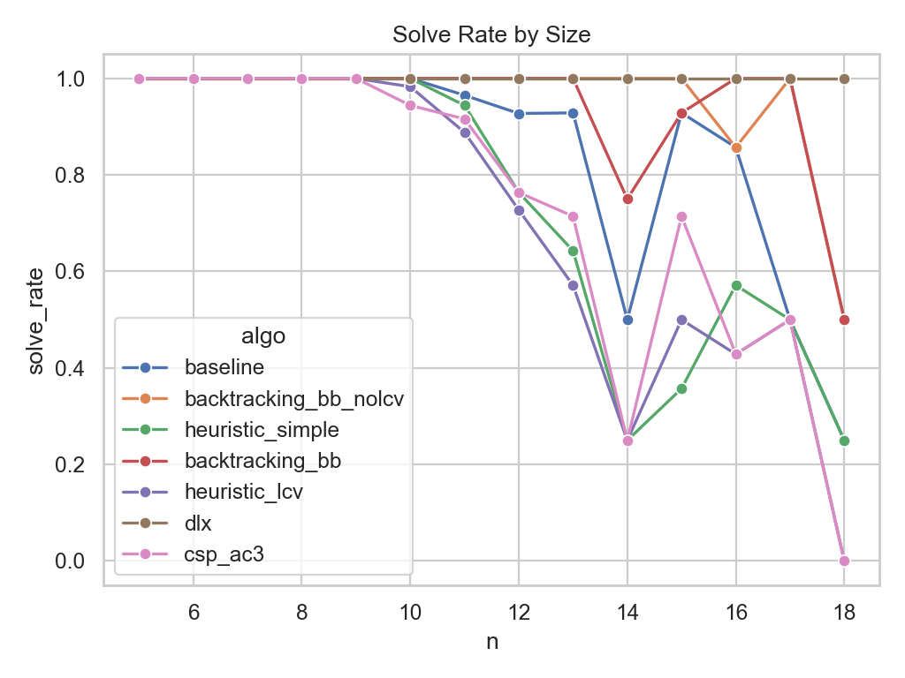

# Queens Data Science Report

## Dataset Overview
- Runs: 11326
- Unique puzzles: 1618
- Source distribution: {'imported': 7224, 'generated': 4102}
- Solution status: {'unique': 1618}

### Size Distribution

| source    |   puzzles |
|:----------|----------:|
| generated |       586 |
| imported  |      1032 |

|   n | source    |   puzzles |
|----:|:----------|----------:|
|   5 | generated |        87 |
|   6 | generated |        98 |
|   6 | imported  |        41 |
|   7 | generated |       100 |
|   7 | imported  |       195 |
|   8 | generated |       100 |
|   8 | imported  |       219 |
|   9 | generated |       100 |
|   9 | imported  |       203 |
|  10 | generated |       101 |
|  10 | imported  |       131 |
|  11 | imported  |       143 |
|  12 | imported  |        55 |
|  13 | imported  |        14 |
|  14 | imported  |         4 |
|  15 | imported  |        14 |
|  16 | imported  |         7 |
|  17 | imported  |         2 |
|  18 | imported  |         4 |

## Global Performance Summary

| algo                  |   runs |   puzzles |   solved |   solved_rate |   timeout_rate |   avg_time_ms |   median_time_ms |   p90_time_ms |   p99_time_ms |   median_nodes |   p90_nodes |   avg_backtracks |
|:----------------------|-------:|----------:|---------:|--------------:|---------------:|--------------:|-----------------:|--------------:|--------------:|---------------:|------------:|-----------------:|
| backtracking_bb_nolcv |   1618 |      1618 |     1615 |         99.81 |           0.19 |       4.75676 |         0.426083 |       5.72634 |      72.3698  |           44   |       527.2 |         364.537  |
| backtracking_bb       |   1618 |      1618 |     1614 |         99.75 |           0.25 |       6.79902 |         0.645687 |       9.17808 |     110.868   |           35   |       511   |         320.682  |
| dlx                   |   1618 |      1618 |     1618 |        100    |           0    |       1.22142 |         0.719521 |       1.9173  |       8.42462 |           12   |        43   |          23.3894 |
| baseline              |   1618 |      1618 |     1600 |         98.89 |           1.11 |      27.5078  |         1.39544  |      62.5736  |     419.868   |         3167.5 |    149053   |        6218.11   |
| csp_ac3               |   1618 |      1618 |     1560 |         96.42 |           3.58 |      52.9032  |         3.22504  |     139.71    |     791.901   |           26   |      1058.2 |         390.295  |
| heuristic_simple      |   1618 |      1618 |     1573 |         97.22 |           2.78 |      49.643   |         3.40267  |     122.363   |     792.929   |          207   |      5867.4 |        1291.91   |
| heuristic_lcv         |   1618 |      1618 |     1558 |         96.29 |           3.71 |      53.9175  |         3.62556  |     146.222   |     799.974   |          138   |      4624.2 |         924.428  |

## Performance by Source

| source    | algo                  |   runs |   puzzles |   solved |   solved_rate |   timeout_rate |   median_time_ms |   p90_time_ms |   median_nodes |
|:----------|:----------------------|-------:|----------:|---------:|--------------:|---------------:|-----------------:|--------------:|---------------:|
| generated | backtracking_bb_nolcv |    586 |       586 |      586 |        100    |           0    |         0.201896 |       1.43356 |           20   |
| generated | backtracking_bb       |    586 |       586 |      586 |        100    |           0    |         0.374687 |       2.08608 |           17   |
| generated | dlx                   |    586 |       586 |      586 |        100    |           0    |         0.493125 |       1.0476  |           10   |
| generated | baseline              |    586 |       586 |      586 |        100    |           0    |         0.800229 |      48.2452  |         1751.5 |
| generated | heuristic_simple      |    586 |       586 |      586 |        100    |           0    |         2.01421  |     104.298   |          138.5 |
| generated | heuristic_lcv         |    586 |       586 |      582 |         99.32 |           0.68 |         2.06269  |     141.353   |           78   |
| generated | csp_ac3               |    586 |       586 |      573 |         97.78 |           2.22 |         2.47483  |     153.936   |           24   |
| imported  | backtracking_bb_nolcv |   1032 |      1032 |     1029 |         99.71 |           0.29 |         0.640833 |       8.51629 |           72   |
| imported  | dlx                   |   1032 |      1032 |     1032 |        100    |           0    |         0.896958 |       2.45272 |           14   |
| imported  | backtracking_bb       |   1032 |      1032 |     1028 |         99.61 |           0.39 |         0.969605 |      16.4368  |           59.5 |
| imported  | baseline              |   1032 |      1032 |     1014 |         98.26 |           1.74 |         1.81979  |      68.9569  |         4307.5 |
| imported  | csp_ac3               |   1032 |      1032 |      987 |         95.64 |           4.36 |         3.6355   |     133.112   |           28   |
| imported  | heuristic_simple      |   1032 |      1032 |      987 |         95.64 |           4.36 |         3.98762  |     138.159   |          240   |
| imported  | heuristic_lcv         |   1032 |      1032 |      976 |         94.57 |           5.43 |         4.44263  |     148.013   |          159   |

## Per-Size Performance Tables

### n = 5

|   n | algo                  |   runs |   puzzles |   solved |   solved_rate |   timeout_rate |   median_time_ms_solved |   p90_time_ms_solved |   p99_time_ms_solved |   median_time_ms_all |   p90_time_ms_all |   p99_time_ms_all |   median_nodes |   p90_nodes |
|----:|:----------------------|-------:|----------:|---------:|--------------:|---------------:|------------------------:|---------------------:|---------------------:|---------------------:|------------------:|------------------:|---------------:|------------:|
|   5 | baseline              |     87 |        87 |       87 |           100 |              0 |                0.054125 |            0.0897666 |             0.102999 |             0.054125 |         0.0897666 |          0.102999 |             72 |       127.2 |
|   5 | backtracking_bb_nolcv |     87 |        87 |       87 |           100 |              0 |                0.062208 |            0.104866  |             0.137691 |             0.062208 |         0.104866  |          0.137691 |              8 |        19   |
|   5 | heuristic_simple      |     87 |        87 |       87 |           100 |              0 |                0.084875 |            0.191967  |             0.315617 |             0.084875 |         0.191967  |          0.315617 |              9 |        24.2 |
|   5 | backtracking_bb       |     87 |        87 |       87 |           100 |              0 |                0.091375 |            0.13065   |             0.176303 |             0.091375 |         0.13065   |          0.176303 |              9 |        15.4 |
|   5 | heuristic_lcv         |     87 |        87 |       87 |           100 |              0 |                0.155541 |            0.253442  |             0.326771 |             0.155541 |         0.253442  |          0.326771 |             10 |        21   |
|   5 | dlx                   |     87 |        87 |       87 |           100 |              0 |                0.205625 |            0.309308  |             0.647616 |             0.205625 |         0.309308  |          0.647616 |              7 |        15.4 |
|   5 | csp_ac3               |     87 |        87 |       87 |           100 |              0 |                0.228458 |            0.326833  |             1.43572  |             0.228458 |         0.326833  |          1.43572  |              6 |         9   |

### n = 6

|   n | algo                  |   runs |   puzzles |   solved |   solved_rate |   timeout_rate |   median_time_ms_solved |   p90_time_ms_solved |   p99_time_ms_solved |   median_time_ms_all |   p90_time_ms_all |   p99_time_ms_all |   median_nodes |   p90_nodes |
|----:|:----------------------|-------:|----------:|---------:|--------------:|---------------:|------------------------:|---------------------:|---------------------:|---------------------:|------------------:|------------------:|---------------:|------------:|
|   6 | backtracking_bb_nolcv |    139 |       139 |      139 |           100 |              0 |                0.115708 |             0.196791 |             0.316255 |             0.115708 |          0.196791 |          0.316255 |             15 |        31.4 |
|   6 | baseline              |    139 |       139 |      139 |           100 |              0 |                0.135    |             0.293559 |             0.414002 |             0.135    |          0.293559 |          0.414002 |            244 |       532.2 |
|   6 | backtracking_bb       |    139 |       139 |      139 |           100 |              0 |                0.155917 |             0.308275 |             2.48977  |             0.155917 |          0.308275 |          2.48977  |             14 |        30.4 |
|   6 | heuristic_simple      |    139 |       139 |      139 |           100 |              0 |                0.263666 |             0.6471   |             1.11122  |             0.263666 |          0.6471   |          1.11122  |             26 |        62.4 |
|   6 | dlx                   |    139 |       139 |      139 |           100 |              0 |                0.29975  |             0.418184 |             1.32599  |             0.29975  |          0.418184 |          1.32599  |             10 |        16   |
|   6 | heuristic_lcv         |    139 |       139 |      139 |           100 |              0 |                0.352709 |             0.89425  |             1.40891  |             0.352709 |          0.89425  |          1.40891  |             20 |        55   |
|   6 | csp_ac3               |    139 |       139 |      139 |           100 |              0 |                0.479125 |             0.952633 |             1.46075  |             0.479125 |          0.952633 |          1.46075  |              9 |        20   |

### n = 7

|   n | algo                  |   runs |   puzzles |   solved |   solved_rate |   timeout_rate |   median_time_ms_solved |   p90_time_ms_solved |   p99_time_ms_solved |   median_time_ms_all |   p90_time_ms_all |   p99_time_ms_all |   median_nodes |   p90_nodes |
|----:|:----------------------|-------:|----------:|---------:|--------------:|---------------:|------------------------:|---------------------:|---------------------:|---------------------:|------------------:|------------------:|---------------:|------------:|
|   7 | backtracking_bb_nolcv |    295 |       295 |      295 |           100 |              0 |                0.197125 |             0.413167 |             0.831923 |             0.197125 |          0.413167 |          0.831923 |             22 |        58   |
|   7 | backtracking_bb       |    295 |       295 |      295 |           100 |              0 |                0.292167 |             0.704167 |             1.49638  |             0.292167 |          0.704167 |          1.49638  |             19 |        61.6 |
|   7 | baseline              |    295 |       295 |      295 |           100 |              0 |                0.301333 |             1.20967  |             1.81395  |             0.301333 |          1.20967  |          1.81395  |            595 |      2507.4 |
|   7 | dlx                   |    295 |       295 |      295 |           100 |              0 |                0.430167 |             0.810583 |             1.64073  |             0.430167 |          0.810583 |          1.64073  |              8 |        16   |
|   7 | heuristic_simple      |    295 |       295 |      295 |           100 |              0 |                0.824583 |             2.84134  |             5.58095  |             0.824583 |          2.84134  |          5.58095  |             64 |       250.4 |
|   7 | heuristic_lcv         |    295 |       295 |      295 |           100 |              0 |                1.09187  |             3.79414  |             7.64279  |             1.09187  |          3.79414  |          7.64279  |             50 |       209   |
|   7 | csp_ac3               |    295 |       295 |      295 |           100 |              0 |                1.15296  |             4.22573  |            11.5578   |             1.15296  |          4.22573  |         11.5578   |             13 |        60   |

### n = 8

|   n | algo                  |   runs |   puzzles |   solved |   solved_rate |   timeout_rate |   median_time_ms_solved |   p90_time_ms_solved |   p99_time_ms_solved |   median_time_ms_all |   p90_time_ms_all |   p99_time_ms_all |   median_nodes |   p90_nodes |
|----:|:----------------------|-------:|----------:|---------:|--------------:|---------------:|------------------------:|---------------------:|---------------------:|---------------------:|------------------:|------------------:|---------------:|------------:|
|   8 | backtracking_bb_nolcv |    319 |       319 |      319 |           100 |              0 |                0.389875 |              1.21998 |              2.60878 |             0.389875 |           1.21998 |           2.60878 |             43 |       141   |
|   8 | backtracking_bb       |    319 |       319 |      319 |           100 |              0 |                0.541792 |              1.69359 |              3.77532 |             0.541792 |           1.69359 |           3.77532 |             33 |       139.6 |
|   8 | dlx                   |    319 |       319 |      319 |           100 |              0 |                0.598333 |              1.11928 |              2.2778  |             0.598333 |           1.11928 |           2.2778  |             10 |        25   |
|   8 | baseline              |    319 |       319 |      319 |           100 |              0 |                1.11204  |              4.89269 |              9.49023 |             1.11204  |           4.89269 |           9.49023 |           2564 |     11594.4 |
|   8 | csp_ac3               |    319 |       319 |      319 |           100 |              0 |                2.83171  |             17.1837  |             48.8729  |             2.83171  |          17.1837  |          48.8729  |             28 |       218.4 |
|   8 | heuristic_simple      |    319 |       319 |      319 |           100 |              0 |                2.93163  |             11.6799  |             24.314   |             2.93163  |          11.6799  |          24.314   |            193 |       853.6 |
|   8 | heuristic_lcv         |    319 |       319 |      319 |           100 |              0 |                3.11821  |             14.8484  |             35.0407  |             3.11821  |          14.8484  |          35.0407  |            126 |       752.6 |

### n = 9

|   n | algo                  |   runs |   puzzles |   solved |   solved_rate |   timeout_rate |   median_time_ms_solved |   p90_time_ms_solved |   p99_time_ms_solved |   median_time_ms_all |   p90_time_ms_all |   p99_time_ms_all |   median_nodes |   p90_nodes |
|----:|:----------------------|-------:|----------:|---------:|--------------:|---------------:|------------------------:|---------------------:|---------------------:|---------------------:|------------------:|------------------:|---------------:|------------:|
|   9 | backtracking_bb_nolcv |    303 |       303 |      303 |           100 |              0 |                0.733708 |              2.97471 |              7.185   |             0.733708 |           2.97471 |           7.185   |             75 |       355.8 |
|   9 | dlx                   |    303 |       303 |      303 |           100 |              0 |                0.808125 |              1.4907  |              3.31334 |             0.808125 |           1.4907  |           3.31334 |             13 |        45.8 |
|   9 | backtracking_bb       |    303 |       303 |      303 |           100 |              0 |                1.052    |              4.80518 |             11.8826  |             1.052    |           4.80518 |          11.8826  |             62 |       363   |
|   9 | baseline              |    303 |       303 |      303 |           100 |              0 |                4.42792  |             29.1046  |             48.9787  |             4.42792  |          29.1046  |          48.9787  |          10539 |     67743.2 |
|   9 | csp_ac3               |    303 |       303 |      303 |           100 |              0 |                8.73025  |            102.875   |            245.322   |             8.73025  |         102.875   |         245.322   |             70 |      1063.6 |
|   9 | heuristic_lcv         |    303 |       303 |      303 |           100 |              0 |               10.2449   |             86.5232  |            174.091   |            10.2449   |          86.5232  |         174.091   |            368 |      3741.2 |
|   9 | heuristic_simple      |    303 |       303 |      303 |           100 |              0 |               10.6902   |             59.0546  |            139.017   |            10.6902   |          59.0546  |         139.017   |            581 |      3936   |

### n = 10

|   n | algo                  |   runs |   puzzles |   solved |   solved_rate |   timeout_rate |   median_time_ms_solved |   p90_time_ms_solved |   p99_time_ms_solved |   median_time_ms_all |   p90_time_ms_all |   p99_time_ms_all |   median_nodes |   p90_nodes |
|----:|:----------------------|-------:|----------:|---------:|--------------:|---------------:|------------------------:|---------------------:|---------------------:|---------------------:|------------------:|------------------:|---------------:|------------:|
|  10 | dlx                   |    232 |       232 |      232 |        100    |           0    |                0.998646 |              1.88535 |              5.41028 |             0.998646 |           1.88535 |           5.41028 |           14   |        43.9 |
|  10 | backtracking_bb_nolcv |    232 |       232 |      232 |        100    |           0    |                1.24015  |              8.39257 |             15.3946  |             1.24015  |           8.39257 |          15.3946  |          101.5 |       853.1 |
|  10 | backtracking_bb       |    232 |       232 |      232 |        100    |           0    |                1.97171  |             10.3538  |             30.5239  |             1.97171  |          10.3538  |          30.5239  |           94   |       658.4 |
|  10 | baseline              |    232 |       232 |      232 |        100    |           0    |               24.2729   |            205.166   |            322.567   |            24.2729   |         205.166   |         322.567   |        61437   |    478445   |
|  10 | csp_ac3               |    232 |       232 |      219 |         94.4  |           5.6  |               34.42     |            457.337   |            928.392   |            37.1323   |         735.787   |        1000.07    |          226   |      3941   |
|  10 | heuristic_lcv         |    232 |       232 |      228 |         98.28 |           1.72 |               41.1395   |            455.289   |            943.007   |            43.2708   |         511.359   |        1000.01    |         1361.5 |     17999.1 |
|  10 | heuristic_simple      |    232 |       232 |      232 |        100    |           0    |               53.5183   |            426.479   |            886.412   |            53.5183   |         426.479   |         886.412   |         2373   |     24848.2 |

### n = 11

|   n | algo                  |   runs |   puzzles |   solved |   solved_rate |   timeout_rate |   median_time_ms_solved |   p90_time_ms_solved |   p99_time_ms_solved |   median_time_ms_all |   p90_time_ms_all |   p99_time_ms_all |   median_nodes |   p90_nodes |
|----:|:----------------------|-------:|----------:|---------:|--------------:|---------------:|------------------------:|---------------------:|---------------------:|---------------------:|------------------:|------------------:|---------------:|------------:|
|  11 | dlx                   |    143 |       143 |      143 |        100    |           0    |                 1.55262 |              3.90718 |               9.5732 |              1.55262 |           3.90718 |            9.5732 |           25   |       135.8 |
|  11 | backtracking_bb_nolcv |    143 |       143 |      143 |        100    |           0    |                 4.19925 |             19.3413  |              51.3229 |              4.19925 |          19.3413  |           51.3229 |          341   |      1816.8 |
|  11 | backtracking_bb       |    143 |       143 |      143 |        100    |           0    |                 5.88387 |             39.5045  |             105.102  |              5.88387 |          39.5045  |          105.102  |          298   |      1989.6 |
|  11 | baseline              |    143 |       143 |      138 |         96.5  |           3.5  |                26.4359  |            262.485   |             756.129  |             27.6747  |         302.381   |         1000      |        65466.5 |    619825   |
|  11 | csp_ac3               |    143 |       143 |      131 |         91.61 |           8.39 |                42.8996  |            380.569   |             802.52   |             52.6597  |         780.793   |         1000.18   |          221   |      2273   |
|  11 | heuristic_simple      |    143 |       143 |      135 |         94.41 |           5.59 |                62.122   |            437.729   |             907.609  |             71.6342  |         627.853   |         1000.02   |         2322   |     18687.8 |
|  11 | heuristic_lcv         |    143 |       143 |      127 |         88.81 |          11.19 |                66.94    |            358.756   |             900.948  |             79.5535  |        1000       |         1000.06   |         1529   |     10406   |

### n = 12

|   n | algo                  |   runs |   puzzles |   solved |   solved_rate |   timeout_rate |   median_time_ms_solved |   p90_time_ms_solved |   p99_time_ms_solved |   median_time_ms_all |   p90_time_ms_all |   p99_time_ms_all |   median_nodes |       p90_nodes |
|----:|:----------------------|-------:|----------:|---------:|--------------:|---------------:|------------------------:|---------------------:|---------------------:|---------------------:|------------------:|------------------:|---------------:|----------------:|
|  12 | dlx                   |     55 |        55 |       55 |        100    |           0    |                 1.70871 |              3.03197 |                5.774 |              1.70871 |           3.03197 |             5.774 |           23   |   101.2         |
|  12 | backtracking_bb_nolcv |     55 |        55 |       55 |        100    |           0    |                 5.87288 |             31.1291  |              158.775 |              5.87288 |          31.1291  |           158.775 |          404   |  2725           |
|  12 | backtracking_bb       |     55 |        55 |       55 |        100    |           0    |                13.6587  |             67.364   |              254.867 |             13.6587  |          67.364   |           254.867 |          611   |  3874.8         |
|  12 | baseline              |     55 |        55 |       51 |         92.73 |           7.27 |                56.9713  |            409.067   |              776.311 |             73.692   |         709.838   |          1000     |       144234   |     1.00103e+06 |
|  12 | csp_ac3               |     55 |        55 |       42 |         76.36 |          23.64 |               147.824   |            837.663   |              967.001 |            483.614   |        1000.12    |          1000.25  |          744   |  4612.1         |
|  12 | heuristic_simple      |     55 |        55 |       42 |         76.36 |          23.64 |               184.16    |            798.268   |              965.006 |            332.904   |        1000.02    |          1000.04  |         6093.5 | 26933.5         |
|  12 | heuristic_lcv         |     55 |        55 |       40 |         72.73 |          27.27 |               247.329   |            816.723   |              946.538 |            491.478   |        1000.04    |          1000.08  |         5036   | 17898.1         |

### n = 13

|   n | algo                  |   runs |   puzzles |   solved |   solved_rate |   timeout_rate |   median_time_ms_solved |   p90_time_ms_solved |   p99_time_ms_solved |   median_time_ms_all |   p90_time_ms_all |   p99_time_ms_all |   median_nodes |   p90_nodes |
|----:|:----------------------|-------:|----------:|---------:|--------------:|---------------:|------------------------:|---------------------:|---------------------:|---------------------:|------------------:|------------------:|---------------:|------------:|
|  13 | dlx                   |     14 |        14 |       14 |        100    |           0    |                 2.45356 |              6.28328 |              9.58661 |              2.45356 |           6.28328 |           9.58661 |           40   |       230   |
|  13 | baseline              |     14 |        14 |       13 |         92.86 |           7.14 |                 7.75792 |            189.226   |            691.84    |              8.33627 |         589.483   |         968.811   |        20566   |    476343   |
|  13 | backtracking_bb_nolcv |     14 |        14 |       14 |        100    |           0    |                 9.15756 |             46.3419  |            145.204   |              9.15756 |          46.3419  |         145.204   |          638.5 |      3981   |
|  13 | backtracking_bb       |     14 |        14 |       14 |        100    |           0    |                11.3209  |            149.249   |            272.249   |             11.3209  |         149.249   |         272.249   |          434.5 |      7443.3 |
|  13 | heuristic_simple      |     14 |        14 |        9 |         64.29 |          35.71 |                24.5497  |            482.411   |            775.794   |            250.697   |        1000.02    |        1000.02    |          822   |     13070.8 |
|  13 | heuristic_lcv         |     14 |        14 |        8 |         57.14 |          42.86 |               120.207   |            638.08    |            741.573   |            670.935   |        1000.02    |        1000.29    |         2223.5 |     12244.9 |
|  13 | csp_ac3               |     14 |        14 |       10 |         71.43 |          28.57 |               139.847   |            750.909   |            764.851   |            405.653   |        1000.15    |        1000.26    |          437.5 |      3571.9 |

### n = 14

|   n | algo                  |   runs |   puzzles |   solved |   solved_rate |   timeout_rate |   median_time_ms_solved |   p90_time_ms_solved |   p99_time_ms_solved |   median_time_ms_all |   p90_time_ms_all |   p99_time_ms_all |   median_nodes |       p90_nodes |
|----:|:----------------------|-------:|----------:|---------:|--------------:|---------------:|------------------------:|---------------------:|---------------------:|---------------------:|------------------:|------------------:|---------------:|----------------:|
|  14 | dlx                   |      4 |         4 |        4 |           100 |              0 |                 2.55942 |              5.67302 |              6.78071 |              2.55942 |           5.67302 |           6.78071 |           48   |   257           |
|  14 | backtracking_bb       |      4 |         4 |        3 |            75 |             25 |                 3.13583 |            269.433   |            329.35    |            169.572   |         800.842   |         980.135   |           67   | 12787.8         |
|  14 | heuristic_lcv         |      4 |         4 |        1 |            25 |             75 |                 7.43108 |              7.43108 |              7.43108 |           1000.03    |        1000.09    |        1000.12    |           81   |    81           |
|  14 | csp_ac3               |      4 |         4 |        1 |            25 |             75 |                25.2655  |             25.2655  |             25.2655  |           1000.06    |        1000.08    |        1000.08    |           68   |    68           |
|  14 | backtracking_bb_nolcv |      4 |         4 |        4 |           100 |              0 |                95.9883  |            423.749   |            526.344   |             95.9883  |         423.749   |         526.344   |         8097.5 | 29788.9         |
|  14 | heuristic_simple      |      4 |         4 |        1 |            25 |             75 |                98.7936  |             98.7936  |             98.7936  |           1000.03    |        1000.05    |        1000.05    |         1695   |  1695           |
|  14 | baseline              |      4 |         4 |        2 |            50 |             50 |               349.536   |            618.436   |            678.939   |            842.831   |        1000       |        1000       |       964145   |     1.70675e+06 |

### n = 15

|   n | algo                  |   runs |   puzzles |   solved |   solved_rate |   timeout_rate |   median_time_ms_solved |   p90_time_ms_solved |   p99_time_ms_solved |   median_time_ms_all |   p90_time_ms_all |   p99_time_ms_all |   median_nodes |       p90_nodes |
|----:|:----------------------|-------:|----------:|---------:|--------------:|---------------:|------------------------:|---------------------:|---------------------:|---------------------:|------------------:|------------------:|---------------:|----------------:|
|  15 | dlx                   |     14 |        14 |       14 |        100    |           0    |                 4.06717 |              14.2722 |              62.7039 |              4.06717 |           14.2722 |           62.7039 |           61   |   618.8         |
|  15 | heuristic_simple      |     14 |        14 |        5 |         35.71 |          64.29 |                44.6443  |             512.053  |             747.505  |           1000.02    |         1000.05   |         1008.49   |          690   |  9743.2         |
|  15 | backtracking_bb_nolcv |     14 |        14 |       14 |        100    |           0    |                55.3302  |             415.294  |             670.681  |             55.3302  |          415.294  |          670.681  |         3309.5 | 29739.8         |
|  15 | backtracking_bb       |     14 |        14 |       13 |         92.86 |           7.14 |                56.2694  |             309.491  |             543.716  |             67.4112  |          502.05   |          944.31   |         1875   | 11799           |
|  15 | baseline              |     14 |        14 |       13 |         92.86 |           7.14 |               167.493   |             485.411  |             549.214  |            192.065   |          538.837  |          942.299  |       462495   |     1.36619e+06 |
|  15 | csp_ac3               |     14 |        14 |       10 |         71.43 |          28.57 |               432.551   |             745.198  |             910.245  |            548.85    |         1000.21   |         1000.72   |         1033   |  2803           |
|  15 | heuristic_lcv         |     14 |        14 |        7 |         50    |          50    |               607.593   |             770.948  |             779.209  |            890.068   |         1000.06   |         1000.11   |         6171   | 10651.4         |

### n = 16

|   n | algo                  |   runs |   puzzles |   solved |   solved_rate |   timeout_rate |   median_time_ms_solved |   p90_time_ms_solved |   p99_time_ms_solved |   median_time_ms_all |   p90_time_ms_all |   p99_time_ms_all |   median_nodes |       p90_nodes |
|----:|:----------------------|-------:|----------:|---------:|--------------:|---------------:|------------------------:|---------------------:|---------------------:|---------------------:|------------------:|------------------:|---------------:|----------------:|
|  16 | dlx                   |      7 |         7 |        7 |        100    |           0    |                 10.0281 |              42.7364 |              70.6253 |              10.0281 |           42.7364 |           70.6253 |            357 |  2064.8         |
|  16 | backtracking_bb_nolcv |      7 |         7 |        6 |         85.71 |          14.29 |                 17.6456 |             135.429  |             219.197  |              23.0937 |          537.11   |          953.728  |            857 |  9759.5         |
|  16 | baseline              |      7 |         7 |        6 |         85.71 |          14.29 |                 18.8992 |             522.902  |             950.769  |              23.3078 |          998.986  |          999.9    |          51896 |     1.34238e+06 |
|  16 | backtracking_bb       |      7 |         7 |        7 |        100    |           0    |                 59.6116 |             480.346  |             760.845  |              59.6116 |          480.346  |          760.845  |           1739 | 17547.4         |
|  16 | heuristic_simple      |      7 |         7 |        4 |         57.14 |          42.86 |                179.815  |             439.84   |             539.698  |             550.793  |         1000.02   |         1000.03   |           2976 |  6006.1         |
|  16 | csp_ac3               |      7 |         7 |        3 |         42.86 |          57.14 |                247.281  |             402.626  |             437.579  |            1000.03   |         1000.24   |         1000.25   |            725 |   980.2         |
|  16 | heuristic_lcv         |      7 |         7 |        3 |         42.86 |          57.14 |                670.363  |             865.644  |             909.583  |            1000.05   |         1000.07   |         1000.09   |           5734 |  8374.8         |

### n = 17

|   n | algo                  |   runs |   puzzles |   solved |   solved_rate |   timeout_rate |   median_time_ms_solved |   p90_time_ms_solved |   p99_time_ms_solved |   median_time_ms_all |   p90_time_ms_all |   p99_time_ms_all |   median_nodes |   p90_nodes |
|----:|:----------------------|-------:|----------:|---------:|--------------:|---------------:|------------------------:|---------------------:|---------------------:|---------------------:|------------------:|------------------:|---------------:|------------:|
|  17 | baseline              |      2 |         2 |        1 |            50 |             50 |                 2.03513 |              2.03513 |              2.03513 |             501.019  |          900.206  |          990.023  |         5508   |      5508   |
|  17 | dlx                   |      2 |         2 |        2 |           100 |              0 |                18.2906  |             26.0651  |             27.8144  |              18.2906 |           26.0651 |           27.8144 |          810.5 |      1158.1 |
|  17 | csp_ac3               |      2 |         2 |        1 |            50 |             50 |                19.172   |             19.172   |             19.172   |             509.611  |          901.963  |          990.242  |           21   |        21   |
|  17 | heuristic_lcv         |      2 |         2 |        1 |            50 |             50 |                29.4493  |             29.4493  |             29.4493  |             514.785  |          903.054  |          990.415  |          184   |       184   |
|  17 | heuristic_simple      |      2 |         2 |        1 |            50 |             50 |                39.9953  |             39.9953  |             39.9953  |             520.012  |          904.025  |          990.428  |          249   |       249   |
|  17 | backtracking_bb_nolcv |      2 |         2 |        2 |           100 |              0 |               138.753   |            246.107   |            270.261   |             138.753  |          246.107  |          270.261  |         6969   |     12384.2 |
|  17 | backtracking_bb       |      2 |         2 |        2 |           100 |              0 |               163.533   |            289.316   |            317.617   |             163.533  |          289.316  |          317.617  |         5765.5 |     10263.5 |

### n = 18

|   n | algo                  |   runs |   puzzles |   solved |   solved_rate |   timeout_rate |   median_time_ms_solved |   p90_time_ms_solved |   p99_time_ms_solved |   median_time_ms_all |   p90_time_ms_all |   p99_time_ms_all |   median_nodes |   p90_nodes |
|----:|:----------------------|-------:|----------:|---------:|--------------:|---------------:|------------------------:|---------------------:|---------------------:|---------------------:|------------------:|------------------:|---------------:|------------:|
|  18 | dlx                   |      4 |         4 |        4 |           100 |              0 |                 8.15096 |              65.6994 |              86.5753 |              8.15096 |           65.6994 |           86.5753 |           93   |      2642.3 |
|  18 | baseline              |      4 |         4 |        1 |            25 |             75 |               162.094   |             162.094  |             162.094  |           1000       |         1000      |         1000      |       458433   |    458433   |
|  18 | backtracking_bb_nolcv |      4 |         4 |        2 |            50 |             50 |               313.673   |             544.506  |             596.444  |            801.112   |         1000.02   |         1000.03   |        12322.5 |     21192.5 |
|  18 | backtracking_bb       |      4 |         4 |        2 |            50 |             50 |               328.031   |             463.092  |             493.481  |            748.433   |         1000.03   |         1000.04   |         7279.5 |     10226.3 |
|  18 | heuristic_simple      |      4 |         4 |        1 |            25 |             75 |               813.366   |             813.366  |             813.366  |           1000.03    |         1000.05   |         1000.06   |        14377   |     14377   |
|  18 | csp_ac3               |      4 |         4 |        0 |             0 |            100 |               nan       |             nan      |             nan      |           1000.21    |         1000.67   |         1000.85   |          nan   |       nan   |
|  18 | heuristic_lcv         |      4 |         4 |        0 |             0 |            100 |               nan       |             nan      |             nan      |           1000.06    |         1000.11   |         1000.11   |          nan   |       nan   |

## Relative Performance vs DLX

| algo                  |   speedup_median |   speedup_p90 |   speedup_p99 |   delta_solve_rate |
|:----------------------|-----------------:|--------------:|--------------:|-------------------:|
| backtracking_bb_nolcv |         0.574487 |       3.97005 |       19.9361 |              -0.19 |
| backtracking_bb       |         0.89049  |       6.52625 |       39.6142 |              -0.25 |
| baseline              |         1.82585  |      50.9763  |      279.687  |              -1.11 |
| csp_ac3               |         4.19513  |     106.393   |      657.473  |              -3.58 |
| heuristic_simple      |         4.51297  |      95.3018  |      582.516  |              -2.78 |
| heuristic_lcv         |         4.79603  |     119.129   |      609.71   |              -3.71 |

## LCV Ablation (backtracking_bb_nolcv vs backtracking_bb)

| metric       |   median_ratio |   p90_ratio |
|:-------------|---------------:|------------:|
| time_ms      |       0.625829 |     1.51221 |
| nodes        |       1.09722  |     3.28571 |
| backtracks   |     nan        |   nan       |
| timeout_rate |       0.75     |   nan       |

## Puzzle Feature Correlations

### Correlation with DLX time (Spearman)

| feature                 |   spearman_corr |   abs_spearman |
|:------------------------|----------------:|---------------:|
| n                       |        0.85259  |       0.85259  |
| num_regions             |        0.85259  |       0.85259  |
| region_size_mean        |        0.85259  |       0.85259  |
| boundary_edges          |        0.83398  |       0.83398  |
| region_size_max         |        0.745217 |       0.745217 |
| region_size_std         |        0.714716 |       0.714716 |
| row_spread_max          |        0.691469 |       0.691469 |
| col_spread_max          |        0.688602 |       0.688602 |
| col_spread_mean         |        0.659801 |       0.659801 |
| boundary_edges_per_cell |       -0.604172 |       0.604172 |
| region_size_gini        |        0.561382 |       0.561382 |
| region_size_cv          |        0.559788 |       0.559788 |
| region_size_median      |        0.372017 |       0.372017 |
| row_spread_mean         |        0.366828 |       0.366828 |
| small_regions_le_3      |        0.255941 |       0.255941 |

### Correlation with baseline timeouts (Spearman)

| feature            |   spearman_corr |   abs_spearman |
|:-------------------|----------------:|---------------:|
| n                  |       0.169626  |      0.169626  |
| region_size_mean   |       0.169626  |      0.169626  |
| num_regions        |       0.169626  |      0.169626  |
| boundary_edges     |       0.167311  |      0.167311  |
| col_spread_max     |       0.144237  |      0.144237  |
| region_size_median |       0.136421  |      0.136421  |
| col_spread_mean    |       0.134415  |      0.134415  |
| row_spread_max     |       0.13233   |      0.13233   |
| region_size_max    |       0.132069  |      0.132069  |
| region_size_std    |       0.130394  |      0.130394  |
| row_spread_mean    |       0.115638  |      0.115638  |
| region_size_min    |      -0.101349  |      0.101349  |
| large_regions_ge_n |       0.100246  |      0.100246  |
| region_size_gini   |       0.0995223 |      0.0995223 |
| small_regions_le_3 |       0.0932225 |      0.0932225 |

### Hard puzzles profile (baseline top-25)

| feature            |      mean |
|:-------------------|----------:|
| n                  | 13.28     |
| num_regions        | 13.28     |
| region_size_min    |  2.04     |
| region_size_mean   | 13.28     |
| region_size_median |  9.84     |
| region_size_max    | 47.6      |
| region_size_std    | 12.5068   |
| region_size_cv     |  0.894529 |
| region_size_gini   |  0.42287  |
| singleton_regions  |  0.32     |
| small_regions_le_3 |  2.12     |
| large_regions_ge_n |  4.92     |
| row_spread_mean    |  4.68041  |
| row_spread_max     | 10.84     |
| col_spread_mean    |  4.73887  |

## Hardest Puzzles (per algorithm)

### backtracking_bb

|   puzzle_id | source   |   n |   time_ms |   nodes |   backtracks | solved   | timeout   |
|------------:|:---------|----:|----------:|--------:|-------------:|:---------|:----------|
|         300 | imported |  14 |  1000.06  |   37046 |        37040 | False    | True      |
|         404 | imported |  18 |  1000.04  |   23740 |        23732 | False    | True      |
|         203 | imported |  15 |  1000.02  |   39898 |        39893 | False    | True      |
|         185 | imported |  18 |  1000.01  |   32058 |        32048 | False    | True      |
|         690 | imported |  16 |   792.011 |   25018 |        25002 | True     | False     |
|         174 | imported |  15 |   571.494 |   27306 |        27291 | True     | False     |
|         987 | imported |  18 |   496.858 |   10963 |        10945 | True     | False     |
|         926 | imported |  15 |   340.016 |   12963 |        12948 | True     | False     |
|         974 | imported |  14 |   336.008 |   15968 |        15954 | True     | False     |
|         953 | imported |  17 |   320.761 |   11388 |        11371 | True     | False     |

### backtracking_bb_nolcv

|   puzzle_id | source   |   n |   time_ms |   nodes |   backtracks | solved   | timeout   |
|------------:|:---------|----:|----------:|--------:|-------------:|:---------|:----------|
|         185 | imported |  18 |  1000.03  |   52889 |        52881 | False    | True      |
|         690 | imported |  16 |  1000.02  |   51269 |        51263 | False    | True      |
|         404 | imported |  18 |  1000.01  |   43897 |        43890 | False    | True      |
|         203 | imported |  15 |   695.268 |   44670 |        44655 | True     | False     |
|         987 | imported |  18 |   602.215 |   23410 |        23392 | True     | False     |
|         300 | imported |  14 |   537.744 |   36361 |        36347 | True     | False     |
|         174 | imported |  15 |   506.14  |   36101 |        36086 | True     | False     |
|         953 | imported |  17 |   272.945 |   13738 |        13721 | True     | False     |
|         285 | imported |  16 |   228.505 |   17014 |        16998 | True     | False     |
|         374 | imported |  15 |   203.319 |   14897 |        14882 | True     | False     |

### baseline

|   puzzle_id | source   |   n |   time_ms |   nodes |   backtracks | solved   | timeout   |
|------------:|:---------|----:|----------:|--------:|-------------:|:---------|:----------|
|         596 | imported |  14 |      1000 | 2529511 |       180673 | False    | True      |
|         953 | imported |  17 |      1000 | 2892668 |       170151 | False    | True      |
|        1015 | imported |  15 |      1000 | 2871757 |       191445 | False    | True      |
|         987 | imported |  18 |      1000 | 2907027 |       161495 | False    | True      |
|         404 | imported |  18 |      1000 | 2646234 |       147008 | False    | True      |
|         185 | imported |  18 |      1000 | 2695666 |       149753 | False    | True      |
|         896 | imported |  11 |      1000 | 2416429 |       219671 | False    | True      |
|         690 | imported |  16 |      1000 | 2885149 |       180316 | False    | True      |
|         114 | imported |  11 |      1000 | 2510961 |       228265 | False    | True      |
|         775 | imported |  12 |      1000 | 2456896 |       204735 | False    | True      |

### csp_ac3

|   puzzle_id | source   |   n |   time_ms |   nodes |   backtracks | solved   | timeout   |
|------------:|:---------|----:|----------:|--------:|-------------:|:---------|:----------|
|         185 | imported |  18 |   1000.87 |    1412 |         1404 | False    | True      |
|         203 | imported |  15 |   1000.8  |    3004 |         3000 | False    | True      |
|         161 | imported |  11 |   1000.32 |    7159 |         7155 | False    | True      |
|         677 | imported |  12 |   1000.31 |    5869 |         5866 | False    | True      |
|         376 | imported |  13 |   1000.27 |    6513 |         6507 | False    | True      |
|         690 | imported |  16 |   1000.25 |    2408 |         2401 | False    | True      |
|         285 | imported |  16 |   1000.23 |    2468 |         2462 | False    | True      |
|         404 | imported |  18 |   1000.23 |    2009 |         1997 | False    | True      |
|         313 | imported |  11 |   1000.22 |    7222 |         7217 | False    | True      |
|         174 | imported |  15 |   1000.21 |    3412 |         3406 | False    | True      |

### heuristic_lcv

|   puzzle_id | source   |   n |   time_ms |   nodes |   backtracks | solved   | timeout   |
|------------:|:---------|----:|----------:|--------:|-------------:|:---------|:----------|
|         563 | imported |  13 |   1000.32 |   16584 |         8677 | False    | True      |
|         474 | imported |  11 |   1000.23 |   32449 |        13892 | False    | True      |
|         953 | imported |  17 |   1000.12 |   13893 |         7633 | False    | True      |
|         300 | imported |  14 |   1000.12 |   17959 |         8260 | False    | True      |
|         404 | imported |  18 |   1000.11 |   10882 |         5461 | False    | True      |
|         374 | imported |  15 |   1000.11 |   17769 |        11870 | False    | True      |
|         855 | imported |  12 |   1000.1  |   29170 |        15618 | False    | True      |
|          30 | imported |  16 |   1000.09 |   14181 |         8737 | False    | True      |
|         185 | imported |  18 |   1000.09 |    7231 |         4211 | False    | True      |
|         677 | imported |  12 |   1000.07 |   26903 |        14916 | False    | True      |

### heuristic_simple

|   puzzle_id | source   |   n |   time_ms |   nodes |   backtracks | solved   | timeout   |
|------------:|:---------|----:|----------:|--------:|-------------:|:---------|:----------|
|        1015 | imported |  15 |   1009.74 |   23755 |        12209 | False    | True      |
|         185 | imported |  18 |   1000.06 |    9261 |         5141 | False    | True      |
|         926 | imported |  15 |   1000.06 |   23012 |        12224 | False    | True      |
|         300 | imported |  14 |   1000.05 |   27031 |        11943 | False    | True      |
|         619 | imported |  12 |   1000.04 |   37090 |        19978 | False    | True      |
|         203 | imported |  15 |   1000.04 |   15136 |         9906 | False    | True      |
|         703 | imported |  12 |   1000.03 |   41182 |        22141 | False    | True      |
|         596 | imported |  14 |   1000.03 |   28644 |        15258 | False    | True      |
|         987 | imported |  18 |   1000.03 |   18690 |         8510 | False    | True      |
|         618 | imported |  15 |   1000.03 |   13094 |         7810 | False    | True      |

## Bias Check: generated vs imported

| source    |       n |   num_regions |   region_size_min |   region_size_mean |   region_size_median |   region_size_max |   region_size_std |   region_size_cv |   region_size_gini |   singleton_regions |   small_regions_le_3 |   large_regions_ge_n |   row_spread_mean |   row_spread_max |   col_spread_mean |   col_spread_max |   boundary_edges |   boundary_edges_per_cell |
|:----------|--------:|--------------:|------------------:|-------------------:|---------------------:|------------------:|------------------:|-----------------:|-------------------:|--------------------:|---------------------:|---------------------:|------------------:|-----------------:|------------------:|-----------------:|-----------------:|--------------------------:|
| generated | 7.56485 |       7.56485 |           4       |            7.56485 |              6.88652 |           12.2048 |           2.87282 |         0.350631 |           0.190197 |            0        |             0.238908 |              3.92662 |           4.09046 |          6.19795 |           3.19462 |          4.93174 |          119.427 |                   2.05484 |
| imported  | 9.10756 |       9.10756 |           2.48934 |            9.10756 |              6.71463 |           26.8605 |           7.56735 |         0.810416 |           0.382388 |            0.250969 |             1.77035  |              3.40019 |           3.7415  |          7.84109 |           3.77858 |          7.88081 |          158.828 |                   1.90054 |

## Charts

## Methodology

- solved: `solved == True` in runs JSONL
- timeout: `timeout == True` in runs JSONL
- time percentiles: computed on solved-only unless noted
- runs source file: `data/benchmarks/queens_runs.jsonl`
- puzzle manifest: `data/puzzles_unique.json`
- python: 3.14.2
- platform: macOS-15.7.3-arm64-arm-64bit-Mach-O
- processor: arm