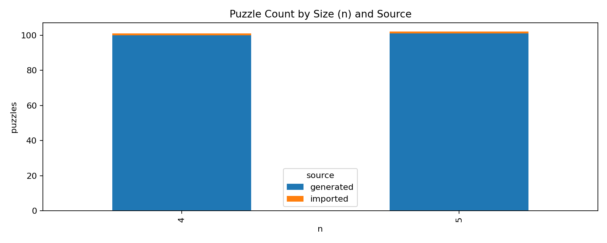
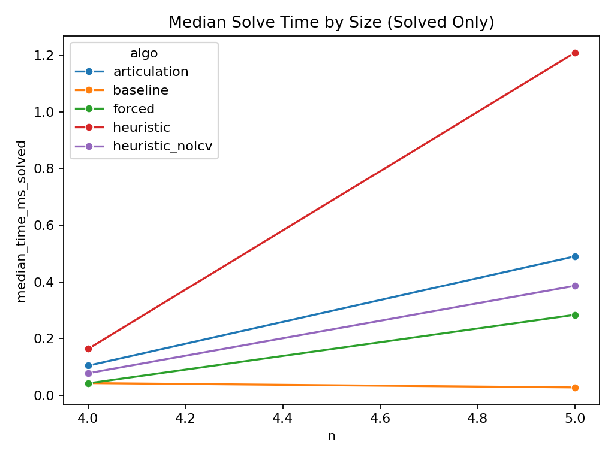
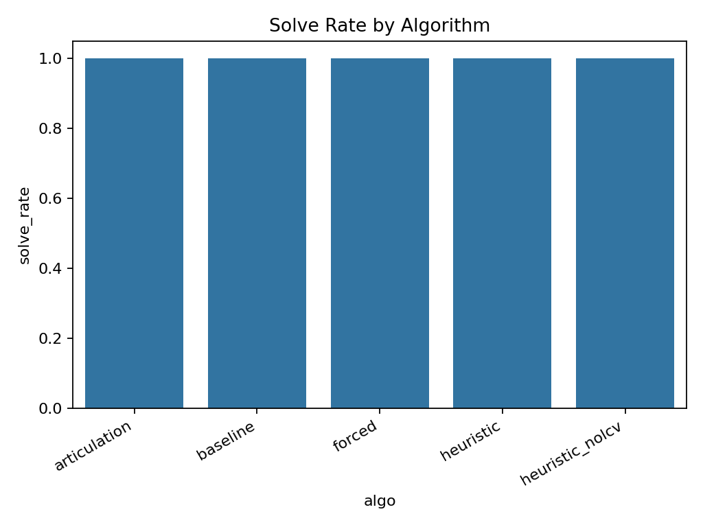
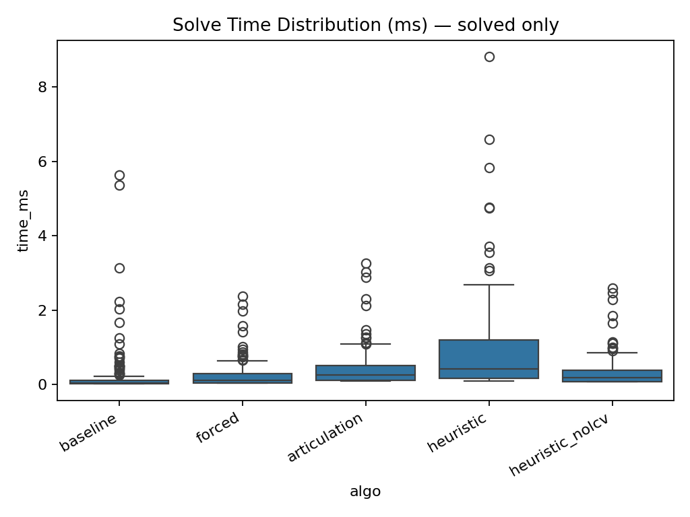

# Zip Data Science Report

## Dataset Overview
- Runs: 1000
- Unique puzzles: 203
- Source distribution: {'generated': 201, 'imported': 2}

### Size Distribution

|   n | source    |   puzzles |
|----:|:----------|----------:|
|   4 | generated |       100 |
|   4 | imported  |         1 |
|   5 | generated |       101 |
|   5 | imported  |         1 |

## Global Performance Summary

| algo            |   puzzles |   solved |   solved_rate |   timeout_rate |   median_time_ms_solved |   p90_time_ms_solved |   p99_time_ms_solved |   median_nodes_solved |   median_backtracks_solved |
|:----------------|----------:|---------:|--------------:|---------------:|------------------------:|---------------------:|---------------------:|----------------------:|---------------------------:|
| articulation    |       200 |      200 |             1 |              0 |                0.242791 |             0.905355 |              2.87662 |                  24   |                          1 |
| baseline        |       200 |      200 |             1 |              0 |                0.037292 |             0.44047  |              3.1531  |                  43   |                         25 |
| forced          |       200 |      200 |             1 |              0 |                0.105083 |             0.606196 |              1.97259 |                  11.5 |                          1 |
| heuristic       |       200 |      200 |             1 |              0 |                0.406333 |             2.02806  |              5.84673 |                  72.5 |                         43 |
| heuristic_nolcv |       200 |      200 |             1 |              0 |                0.180229 |             0.802121 |              2.28579 |                  25.5 |                          1 |

## Performance by Source

| algo            | source    |   puzzles |   solved |   solved_rate |   timeout_rate |   median_time_ms_solved |
|:----------------|:----------|----------:|---------:|--------------:|---------------:|------------------------:|
| articulation    | generated |       200 |      200 |             1 |              0 |                0.242791 |
| baseline        | generated |       200 |      200 |             1 |              0 |                0.037292 |
| forced          | generated |       200 |      200 |             1 |              0 |                0.105083 |
| heuristic       | generated |       200 |      200 |             1 |              0 |                0.406333 |
| heuristic_nolcv | generated |       200 |      200 |             1 |              0 |                0.180229 |

## Performance by Size

|   n | algo            |   puzzles |   solved_rate |   timeout_rate |   median_time_ms_solved |   p90_time_ms_solved |   p99_time_ms_solved |   median_nodes_solved |
|----:|:----------------|----------:|--------------:|---------------:|------------------------:|---------------------:|---------------------:|----------------------:|
|   4 | articulation    |       100 |             1 |              0 |               0.104104  |             0.194241 |             0.310165 |                  15   |
|   4 | baseline        |       100 |             1 |              0 |               0.042625  |             0.127279 |             0.193934 |                  55   |
|   4 | forced          |       100 |             1 |              0 |               0.0416665 |             0.112867 |             0.180099 |                   5   |
|   4 | heuristic       |       100 |             1 |              0 |               0.163271  |             0.363445 |             0.596484 |                  30   |
|   4 | heuristic_nolcv |       100 |             1 |              0 |               0.0773955 |             0.147429 |             0.245267 |                  16   |
|   5 | articulation    |       100 |             1 |              0 |               0.490437  |             1.10856  |             3.03498  |                  51   |
|   5 | baseline        |       100 |             1 |              0 |               0.0272495 |             0.755058 |             5.35612  |                  32   |
|   5 | forced          |       100 |             1 |              0 |               0.283646  |             0.76203  |             2.1525   |                  35.5 |
|   5 | heuristic       |       100 |             1 |              0 |               1.20967   |             2.67354  |             6.62214  |                 175.5 |
|   5 | heuristic_nolcv |       100 |             1 |              0 |               0.386146  |             0.965459 |             2.46863  |                  59   |

## Relative Performance vs Baseline

| algo            |   speedup_median |   delta_solve_rate |
|:----------------|-----------------:|-------------------:|
| articulation    |          3.84765 |                  0 |
| forced          |          1.56209 |                  0 |
| heuristic       |          6.04135 |                  0 |
| heuristic_nolcv |          2.87412 |                  0 |

## Hardest Puzzles (Top 5 per Algo)

| algo            |   puzzle_id | source    |   n |   time_ms |   nodes |   backtracks |
|:----------------|------------:|:----------|----:|----------:|--------:|-------------:|
| articulation    |         135 | generated |   5 |   3.25175 |     322 |          298 |
| articulation    |         170 | generated |   5 |   3.03279 |     325 |          301 |
| articulation    |         167 | generated |   5 |   2.87504 |     303 |          279 |
| articulation    |         189 | generated |   5 |   2.305   |     227 |          203 |
| articulation    |         147 | generated |   5 |   2.11554 |     217 |          193 |
| baseline        |         104 | generated |   5 |   5.63196 |    6629 |         6116 |
| baseline        |         113 | generated |   5 |   5.35333 |    6400 |         6037 |
| baseline        |         178 | generated |   5 |   3.13088 |    3676 |         3225 |
| baseline        |         189 | generated |   5 |   2.22208 |    3094 |         1976 |
| baseline        |         174 | generated |   5 |   2.02896 |    2649 |         1929 |
| forced          |         135 | generated |   5 |   2.37921 |     301 |          285 |
| forced          |         167 | generated |   5 |   2.15021 |     278 |          262 |
| forced          |         170 | generated |   5 |   1.97079 |     261 |          246 |
| forced          |         189 | generated |   5 |   1.57967 |     183 |          167 |
| forced          |         147 | generated |   5 |   1.4155  |     186 |          170 |
| heuristic       |         135 | generated |   5 |   8.82187 |    1358 |         1018 |
| heuristic       |         170 | generated |   5 |   6.59992 |     950 |          797 |
| heuristic       |         167 | generated |   5 |   5.83913 |     886 |          667 |
| heuristic       |         185 | generated |   5 |   4.75596 |     704 |          546 |
| heuristic       |         189 | generated |   5 |   4.75346 |     769 |          509 |
| heuristic_nolcv |         135 | generated |   5 |   2.59738 |     427 |          301 |
| heuristic_nolcv |         170 | generated |   5 |   2.46733 |     406 |          301 |
| heuristic_nolcv |         167 | generated |   5 |   2.28396 |     398 |          279 |
| heuristic_nolcv |         189 | generated |   5 |   1.85079 |     319 |          203 |
| heuristic_nolcv |         147 | generated |   5 |   1.64475 |     294 |          193 |